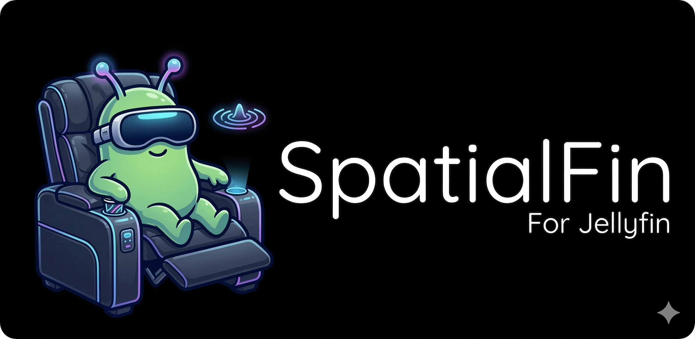

# SpatialFin



A Jellyfin client built specifically for Android XR, delivering an immersive spatial media experience.

> **Forked from [Findroid](https://github.com/jarnedemeulemeester/findroid)** — SpatialFin started as a fork of Findroid, an open-source native Jellyfin client for Android. We thank the Findroid contributors for their excellent work.

## Features

- **Immersive Experience** — Native Full Space Mode (FSM) with massive, spatial panels that fill your field of view for a cinematic theater feel.
- **Glassmorphic UI** — Modern "liquid glass" interface with translucent panels that blend naturally into your environment.
- **Interactive Agency** — Grab and move the entire application or video player window anywhere in your 3D space.
- **Stereoscopic 3D** — Automatic detection and rendering of SBS, top-bottom, and other 3D formats.
- **Spatial Audio** — High-fidelity positional audio that pins sound to the screen's location.
- **Native XR Controls** — Material 3 for XR orbiters that float secondary controls in space, keeping the screen uncluttered.
- **Pixel-Perfect Anime Subtitles** — Integrated `libass` JNI renderer for flawless ASS/SSA subtitle rendering, supporting complex typesetting and animations.
- **Version Selection (Media Source)** — Choose between different versions of the same movie or episode (e.g., 3D vs. 2D, 4K vs. 1080p) before playing or during playback.
- **Dynamic Quality Selection** — Control streaming bitrate on the fly. Use the sparkle icon in the player or the media info screen to switch between bitrates (from 480 Kbps up to 120 Mbps) or stay on "Auto" for direct play.
- **Hands-Free Voice Control** — Pinch-to-talk on the secondary hand or use the mic orbiter button to control playback, audio, subtitles, quality, and search with on-device speech recognition plus Gemini Nano intent parsing.
- **Global Bitrate Settings** — Set a default maximum streaming bitrate in the app settings to optimize for your network conditions across all media.
- **In-Player AI Search** — Voice search now opens as a spatial overlay inside the XR player so you can search and launch new media without breaking immersion.
- **Voice Diagnostics** — A dedicated voice settings section shows enablement, permissions, on-device availability, example commands, and local telemetry summaries for tuning the experience.
- **Jellyfin Integration** — Full Jellyfin server connectivity: browse movies, shows, episodes, and collections.
- **Local Library** — Browse and play videos stored directly on the XR device, with filename-based metadata inference plus local watched/resume tracking.
- **Automatic Offline Mode** — SpatialFin monitors server reachability and automatically switches into offline mode when the selected Jellyfin server is unavailable, then switches back online when the server becomes reachable again.
- **Offline Playback** — Download media for offline viewing and continue watching local or downloaded media without server access.
- **Smart Download Reconciliation** — If files disappear from the download folder outside the app, SpatialFin removes the stale entries from its catalog automatically.
- **Configurable Downloads** — Download the original server file or request a smaller transcoded version with a selected bitrate, audio track, and subtitle track.
- **In-App Download Management** — Delete downloads from the item screen or directly from the Downloads tab.

## Offline And Downloads

SpatialFin now treats offline support as a first-class mode instead of a manual fallback.

- The app continuously checks whether the active Jellyfin server is reachable.
- If the server or network becomes unavailable, SpatialFin automatically falls back to offline mode.
- When connectivity returns, SpatialFin switches back to online mode and resumes normal Jellyfin-backed behavior.
- Downloaded items remain available from the Downloads tab while offline.
- Local headset videos remain available from the Local tab regardless of server state.

### Download Storage

All app-managed downloads are stored in the public Android downloads area under:

```text
Downloads/SpatialFin
```

This makes the files easier to inspect, copy, back up, or manage from outside the app.

### Download Types

SpatialFin supports two download strategies:

1. **Original file**
Keeps the media exactly as stored on the Jellyfin server for maximum fidelity.

2. **Smaller transcoded file**
Requests a server-side transcode so you can save space by choosing:
- a lower target bitrate
- a specific audio track
- a specific subtitle track

### Deleting Downloads

You can remove downloads in two ways:

1. From the media detail screen using the trash/delete action.
2. From the Downloads tab using the inline delete action on each downloaded item.

If you delete the file manually from `Downloads/SpatialFin`, SpatialFin detects that the file is gone and removes the stale entry from the app automatically.

### Behavior Summary

- Online browsing uses the Jellyfin server when available.
- Offline browsing uses cached/downloaded media when the server is unavailable.
- Playback progress and media state continue to work for local and downloaded content.
- Reconnection triggers a sync pass so offline state can be pushed back when the server is available again.

## Requirements

- Android XR device (requires `android.hardware.xr.immersive` feature)
- Android 12 (API 31) or higher
- Optional: a running [Jellyfin](https://jellyfin.org) server

## Local Library

SpatialFin can now operate as a local-first XR player, even without a Jellyfin server.

- A dedicated `Local` category scans videos stored on the headset through `MediaStore`.
- Local playback works online or offline.
- SpatialFin parses file names to infer cleaner titles and basic season/episode or year metadata when possible.
- Local watch progress and watched/unwatched state are stored on-device, so resume works without any server.
- On first app launch, SpatialFin also requests video-library permission so the local library can be populated immediately.

## Voice Control

SpatialFin now supports hands-free voice control in the XR player.

- Pinch your secondary hand to start listening and release to stop.
- Use the mic button in the player orbiter as a fallback.
- Speech recognition runs on-device and prefers offline recognition.
- Commands are mapped to existing player actions such as play, pause, seek, skip intro, subtitle toggles, audio-track changes, quality/bitrate adjustments, controls visibility, next/previous episode, and search.
- Search results are shown in a spatial in-player overlay with a clear path back to the current video.
- Voice parsing uses both deterministic command handling and richer multimodal player context for compatible on-device AI devices.
- On first app launch, SpatialFin requests the microphone, hand-tracking, and local video permissions needed for voice input and the on-device library.
- Voice settings include status, command examples, and a local telemetry dashboard for iteration and debugging.

## Architecture

SpatialFin is a multi-module Android project:

| Module | Description |
|--------|-------------|
| `app/xr` | Android XR application entry point |
| `player/xr` | Immersive XR player with spatial UI |
| `player/local` | Local playback engine (ExoPlayer) |
| `player/core` | Player abstractions and interfaces |
| `modes/film` | Browse movies, shows, and episodes |
| `data` | Jellyfin API client, database, repository |
| `core` | Shared UI components and utilities |
| `settings` | User preferences |
| `setup` | Server onboarding flow |

## Building

```bash
./gradlew :app:xr:assembleLibreDebug
```

The debug APK is generated at:

```text
app/xr/build/outputs/apk/libre/debug/spatialfin-libre-arm64-v8a-debug.apk
```

## License

SpatialFin is open source software. See [LICENSE](LICENSE) for details.

Original Findroid license applies to code inherited from that project.
